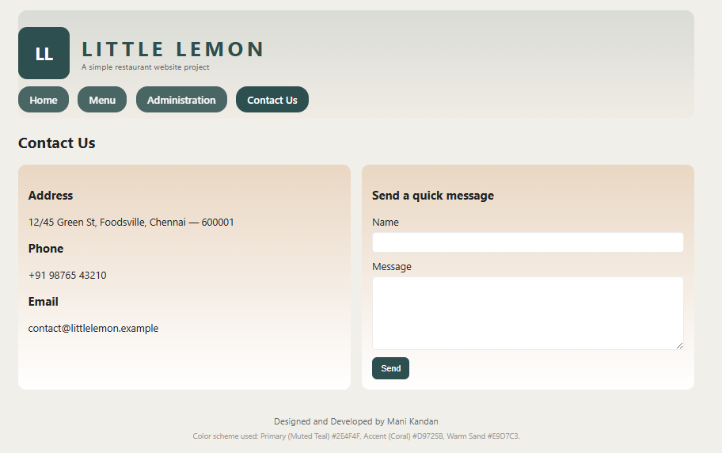

# Ex.07 Restaurant Website
# Date:07/10/2025
# AIM:
To develop a static Restaurant website to display the food items and services provided by them.

# DESIGN STEPS:
## Step 1:
Requirement collection.

## Step 2:
Creating the layout using HTML and CSS.

## Step 3:
Updating the sample content.

## Step 4:
Choose the appropriate style and color scheme.

## Step 5:
Validate the layout in various browsers.

## Step 6:
Validate the HTML code.

## Step 7:
Publish the website in the given URL.

# PROGRAM:
```
<!doctype html>

<html lang="en">
<head>
  <meta charset="utf-8">
  <meta name="viewport" content="width=device-width,initial-scale=1">
  <title>Little Lemon — Project</title>
  <style>
    :root{
      --bg:#f1efe9; /* light paper */
      --accent:#d9725b; /* coral accent */
      --primary:#2e4f4f; /* muted teal */
      --muted:#e9d7c3; /* warm sand */
      --card:#ffffff;
      --text:#222;
      --radius:12px;
      font-family: 'Segoe UI', Roboto, Arial, sans-serif;
    }
    *{box-sizing:border-box}
    body{margin:0;background:var(--bg);color:var(--text);}
    .container{max-width:1100px;margin:24px auto;padding:0 16px}/* Header / Banner */
header.site{background:linear-gradient(180deg, rgba(46,79,79,0.12), rgba(233,215,195,0.12));padding:26px 0 10px;border-radius:14px}
.brand{display:flex;align-items:center;gap:18px}
.logo{width:82px;height:82px;border-radius:14px;display:flex;align-items:center;justify-content:center;background:var(--primary);color:white;font-weight:700;font-size:28px}
.brand h1{margin:0;letter-spacing:6px;color:var(--primary);font-weight:700}

nav.main{margin-top:14px}
nav.main ul{list-style:none;padding:0;margin:0;display:flex;gap:14px}
nav.main a{display:inline-block;padding:10px 18px;background:var(--primary);color:#fff;border-radius:18px;text-decoration:none;font-weight:600}

/* Hero */
.hero{margin-top:16px;border-radius:14px;overflow:hidden;background:linear-gradient(90deg, rgba(217,112,84,0.12), rgba(233,215,195,0.08));position:relative}
.hero .hero-inner{display:flex;gap:18px;padding:20px}
.hero .left{flex:1}
.hero h2{margin:0;color:var(--card);font-size:28px;text-shadow:0 1px 0 rgba(0,0,0,0.15)}
.hero p{margin-top:8px;color:rgba(255,255,255,0.92);max-width:66%}
.hero .image{width:45%;min-width:220px;background-image: url('data:image/svg+xml;utf8,<svg xmlns="http://www.w3.org/2000/svg" width="800" height="300"><rect width="100%" height="100%" fill="%23d9d9d9"/><g fill="%23d9725b" opacity="0.12"><circle cx="60" cy="60" r="50"/><circle cx="160" cy="110" r="80"/></g><text x="30" y="170" font-size="42" fill="%23333">Banner Image (changed)</text></svg>');background-size:cover;background-position:center}

/* cards */
.three{display:grid;grid-template-columns:repeat(3,1fr);gap:18px;margin-top:20px}
.card{background:var(--card);padding:16px;border-radius:12px;box-shadow:0 2px 0 rgba(0,0,0,0.04)}
.card h3{margin-top:0}
.card p.small{font-size:13px;color:#666}
.card img.food{width:100%;height:160px;object-fit:cover;border-radius:8px}

/* Menu grid */
.menu-grid{display:grid;grid-template-columns:repeat(4,1fr);gap:14px}
.menu-item{background:linear-gradient(180deg,rgba(233,215,195,0.6),#fff);padding:12px;border-radius:10px;border:1px solid rgba(46,79,79,0.06)}
.menu-item h4{margin:6px 0}
.price{font-weight:700;color:var(--primary)}

/* Admin */
.people{display:grid;grid-template-columns:repeat(3,1fr);gap:18px}
.person{display:flex;gap:12px;align-items:center;padding:12px;background:var(--card);border-radius:10px}
.avatar{width:72px;height:72px;border-radius:50%;display:inline-grid;place-items:center;font-weight:700}

/* Contact */
.contact-grid{display:grid;grid-template-columns:1fr 1fr;gap:18px}
.contact-card{padding:16px;background:linear-gradient(180deg,var(--muted),#fff);border-radius:12px}

footer{margin-top:22px;text-align:center;padding:18px 10px;color:#666;font-size:14px}

/* Responsive */
@media (max-width:900px){.three{grid-template-columns:repeat(2,1fr)}.menu-grid{grid-template-columns:repeat(2,1fr)}.people{grid-template-columns:repeat(2,1fr)}.hero .image{display:none}}
@media (max-width:520px){nav.main ul{flex-wrap:wrap}nav.main a{padding:8px 12px;font-size:14px}.three{grid-template-columns:1fr}.menu-grid{grid-template-columns:1fr}.people{grid-template-columns:1fr}.contact-grid{grid-template-columns:1fr}}

/* page sections */
section{display:none}
section.active{display:block}

  </style>
</head>
<body>
  <div class="container">
    <header class="site">
      <div class="brand">
        <div class="logo">LL</div>
        <div>
          <h1>LITTLE LEMON</h1>
          <div style="font-size:13px;color:#666">A simple restaurant website project</div>
        </div>
      </div><nav class="main" style="margin-top:12px">
    <ul>
      <li><a href="#home" data-target="home">Home</a></li>
      <li><a href="#menu" data-target="menu">Menu</a></li>
      <li><a href="#admin" data-target="admin">Administration</a></li>
      <li><a href="#contact" data-target="contact">Contact Us</a></li>
    </ul>
  </nav>
</header>

<!-- HOME -->
<main id="home" class="active-section">
  <section id="home" class="active">
    <div class="hero">
      <div class="hero-inner">
        <div class="left">
          <h2 style="color:var(--card);">30% Off This Weekend</h2>
          <p>Enjoy handcrafted dishes, locally-sourced ingredients and warm hospitality. Book your table and taste what everyone is talking about.</p>
        </div>
        <div class="image"></div>
      </div>
    </div>

    <div class="three">
      <div class="card">
        <h3>Our New Menu</h3>
        <rect width='100%' height='100%' fill='%23e9d7c3'/><text x='30' y='200' font-size='36' fill='%232e4f4f'>Grilled Kebabs</text></svg>" alt="food">
        <p class="small">A selection of grilled favorites made with fresh spices and grilled to perfection.</p>
        <a href="#menu" data-target="menu">See our new menu</a>
      </div>

      <div class="card">
        <h3>Book a table</h3>
        <rect width='100%' height='100%' fill='%23d9725b'/><text x='30' y='200' font-size='36' fill='%23fff'>Reserve</text></svg>" alt="book">
        <p class="small">Reserve your place online — we keep tables safe and cozy for every guest.</p>
        <a href="#contact" data-target="contact">Book your table now</a>
      </div>

      <div class="card">
        <h3>Opening Hours</h3>
        <rect width='100%' height='100%' fill='%239ec5c5'/><text x='30' y='200' font-size='36' fill='%232e4f4f'>Hours</text></svg>" alt="hours">
        <p class="small">Mon - Fri: 2pm - 10pm<br>Sat: 12pm - 11pm<br>Sun: 2pm - 9pm</p>
      </div>
    </div>

    <div style="margin-top:18px;height:6px;background:rgba(46,79,79,0.06);border-radius:6px"></div>

  </section>
</main>

<!-- MENU -->
<section id="menu">
  <h2>Menu — 12 Delicious Items</h2>
  <p style="color:#666">All prices in ₹</p>
  <div class="menu-grid" style="margin-top:12px">
    <!-- 12 items -->
    <div class="menu-item"><h4>Margherita Pizza</h4><div class="price">₹249</div><p class="small">Classic tomato, basil and mozzarella.</p></div>
    <div class="menu-item"><h4>Paneer Tikka</h4><div class="price">₹199</div><p class="small">Smoky paneer cubes with spices.</p></div>
    <div class="menu-item"><h4>Chicken Alfredo</h4><div class="price">₹349</div><p class="small">Creamy pasta with grilled chicken.</p></div>
    <div class="menu-item"><h4>Veg Biryani</h4><div class="price">₹229</div><p class="small">Aromatic rice with seasonal vegetables.</p></div>
    <div class="menu-item"><h4>Grilled Salmon</h4><div class="price">₹399</div><p class="small">Lightly seasoned with lemon butter.</p></div>
    <div class="menu-item"><h4>Caesar Salad</h4><div class="price">₹179</div><p class="small">Crisp romaine with tangy dressing.</p></div>
    <div class="menu-item"><h4>Classic Burger</h4><div class="price">₹199</div><p class="small">Beef patty, lettuce, tomato and cheese.</p></div>
    <div class="menu-item"><h4>Fish Fry</h4><div class="price">₹249</div><p class="small">Crispy spiced fish with chutney.</p></div>
    <div class="menu-item"><h4>Sizzling Brownie</h4><div class="price">₹159</div><p class="small">Warm brownie with ice cream.</p></div>
    <div class="menu-item"><h4>Masala Dosa</h4><div class="price">₹119</div><p class="small">Crispy dosa with potato masala.</p></div>
    <div class="menu-item"><h4>Lemon Chicken</h4><div class="price">₹289</div><p class="small">Tangy & flavorful chicken dish.</p></div>
    <div class="menu-item"><h4>Garlic Naan</h4><div class="price">₹49</div><p class="small">Freshly baked tandoor bread.</p></div>
  </div>
</section>

<!-- ADMINISTRATION -->
<section id="admin">
  <h2>Administration</h2>
  <p style="color:#666">Meet our team</p>
  <div class="people" style="margin-top:12px">
    <!-- 6 people with photos (SVG avatars) -->
    <div class="person card">
      <div class="avatar" style="background:linear-gradient(135deg,var(--primary),var(--accent));color:white">RS</div>
      <div>
        <strong>R. Selvakumar</strong><div class="small">Owner & Head Chef</div>
      </div>
    </div>

    <div class="person card">
      <div class="avatar" style="background:linear-gradient(135deg,var(--accent),#f5b8a0);color:white">AL</div>
      <div>
        <strong>A. Lakshmi</strong><div class="small">Restaurant Manager</div>
      </div>
    </div>

    <div class="person card">
      <div class="avatar" style="background:linear-gradient(135deg,#9ec5c5,var(--muted));color:var(--primary)">VK</div>
      <div>
        <strong>V. Kumar</strong><div class="small">Sous Chef</div>
      </div>
    </div>

    <div class="person card">
      <div class="avatar" style="background:linear-gradient(135deg,#f4d6c2,#d9725b);color:white">TM</div>
      <div>
        <strong>T. Meena</strong><div class="small">Head Waiter</div>
      </div>
    </div>

    <div class="person card">
      <div class="avatar" style="background:linear-gradient(135deg,#cfe8e8,#2e4f4f);color:white">SN</div>
      <div>
        <strong>S. Natarajan</strong><div class="small">Pastry Chef</div>
      </div>
    </div>

    <div class="person card">
      <div class="avatar" style="background:linear-gradient(135deg,#ffd7c4,#d9725b);color:var(--primary)">JP</div>
      <div>
        <strong>J. Priya</strong><div class="small">Front Desk & Reservations</div>
      </div>
    </div>

  </div>
</section>

<!-- CONTACT -->
<section id="contact">
  <h2>Contact Us</h2>
  <div class="contact-grid" style="margin-top:12px">
    <div class="contact-card">
      <h3>Address</h3>
      <p>12/45 Green St, Foodsville, Chennai — 600001</p>
      <h3>Phone</h3>
      <p>+91 98765 43210</p>
      <h3>Email</h3>
      <p>contact@littlelemon.example</p>
    </div>

    <div class="contact-card">
      <h3>Send a quick message</h3>
      <form onsubmit="alert('This is a static demo — form not submitted');return false;">
        <label>Name<br><input required style="width:100%;padding:8px;margin-top:6px;border-radius:6px;border:1px solid rgba(0,0,0,0.08)"></label>
        <label style="display:block;margin-top:10px">Message<br><textarea required style="width:100%;padding:8px;margin-top:6px;border-radius:6px;border:1px solid rgba(0,0,0,0.08)" rows="6"></textarea></label>
        <button style="margin-top:8px;padding:10px 14px;border-radius:8px;border:0;background:var(--primary);color:white">Send</button>
      </form>
    </div>
  </div>
</section>

<footer>
  <div>Designed and Developed by Mani Kandan</div>
  <div style="font-size:12px;margin-top:6px;color:#999">Color scheme used: Primary (Muted Teal) #2E4F4F, Accent (Coral) #D9725B, Warm Sand #E9D7C3.</div>
</footer>

  </div>  <script>
    // simple page switcher — single-file site to emulate multiple pages
    const links = document.querySelectorAll('nav.main a');
    function show(id){
      document.querySelectorAll('section').forEach(s=>s.classList.remove('active'));
      const el = document.getElementById(id);
      if(el) el.classList.add('active');
      // update active link style
      links.forEach(a=>a.style.opacity = (a.dataset.target===id)?'1':'0.86');
    }
    links.forEach(a=>a.addEventListener('click', (e)=>{e.preventDefault(); const t=a.dataset.target; show(t); window.scrollTo({top:0,behavior:'smooth'})}));
    // default show home
    show('home');
  </script>  <!-- Report: color scheme chosen for the project
       - Primary (muted teal): #2E4F4F — used for header, buttons and main accents
       - Accent (coral): #D9725B — used for highlight buttons and warm tones
       - Warm Sand: #E9D7C3 — used for background cards and soft areas
       These choices give a warm, welcoming restaurant feel while keeping good contrast.
  --></body>
</html>
```
# OUTPUT:



# RESULT:
The program for designing software company website using HTML and CSS is completed successfully.
